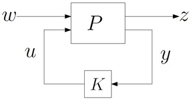
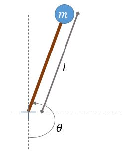

# Control Theory
## PID Controller for Inverted Pendulum

***Control theory*** in control systems engineering is a subfield of mathematics that deals with the control of continuously operating dynamical systems in engineered processes and machines. The objective is to develop a control model for controlling such systems using a control action in an optimum manner without delay or overshoot and ensuring control stability. *-from wikipedia.org*  

An ***inverted pendulum*** is a pendulum that has its center of mass above its pivot point. It is unstable and without additional help will fall over. It can be suspended stably in this inverted position by using a control system to monitor the angle of the pole and move the pivot point horizontally back under the center of mass when it starts to fall over, keeping it balanced. The inverted pendulum is a classic problem in dynamics and control theory and is used as a benchmark for testing control strategies. *-from wikipedia.org*  

A ***proportional–integral–derivative controller (PID controller. or three-term controller)*** is a control loop mechanism employing feedback that is widely used in industrial control systems and a variety of other applications requiring continuously modulated control. A PID controller continuously calculates an error value as the difference between a desired setpoint (SP) and a measured process variable (PV) and applies a correction based on proportional, integral, and derivative terms (denoted P, I, and D respectively), hence the name. *-from wikipedia.org*  
